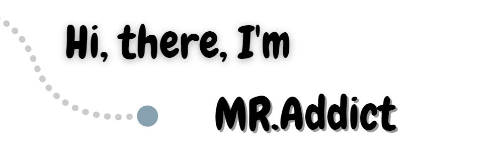

- 👀 I’m interested in DIY, especially expert at Arduino projects.
- 💻 My programming skills including C/C++, python, html, css, js.
- 💖 I also master solidworks, photoshop and EDA design.
- 🎇 Welcome to my [Github pages](https://mr-addict.github.io/Index/).
- 
<!---
# My Github Status:

# Most Used Languages:

--->

<!---
MR-Addict/MR-Addict is a ✨ special ✨ repository because its `README.md` (this file) appears on your GitHub profile.
You can click the Preview link to take a look at your changes.
--->
